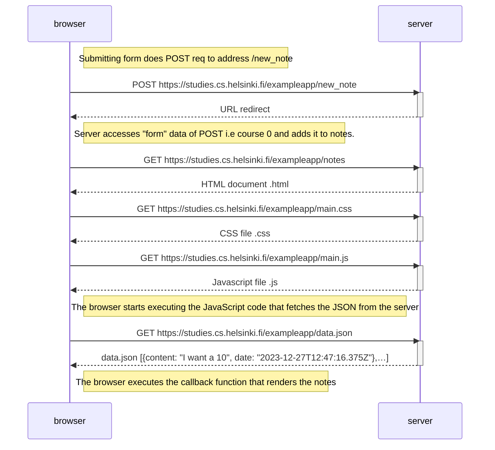

```mermaid
sequenceDiagram
    participant browser
    participant server

    Note right of browser: Submitting form does POST req to address /new_note

    browser->>server: POST https://studies.cs.helsinki.fi/exampleapp/new_note
    activate server
    server-->>browser: URL redirect 
    deactivate server

    Note right of browser: Server accesses "form" data of POST i.e course 0 and adds it to notes.

    browser->>server: GET https://studies.cs.helsinki.fi/exampleapp/notes
    activate server
    server-->>browser: HTML document .html
    deactivate server

    browser->>server: GET https://studies.cs.helsinki.fi/exampleapp/main.css
    activate server
    server-->>browser:  CSS file .css
    deactivate server

    browser->>server: GET https://studies.cs.helsinki.fi/exampleapp/main.js
    activate server
    server-->>browser: Javascript file .js
    deactivate server

    Note right of browser: The browser starts executing the JavaScript code that fetches the JSON from the server 
    
    browser->>server: GET https://studies.cs.helsinki.fi/exampleapp/data.json
    activate server
    server-->>browser: data.json [{content: "I want a 10", date: "2023-12-27T12:47:16.375Z"},…]
    deactivate server

    Note right of browser: The browser executes the callback function that renders the notes

```
